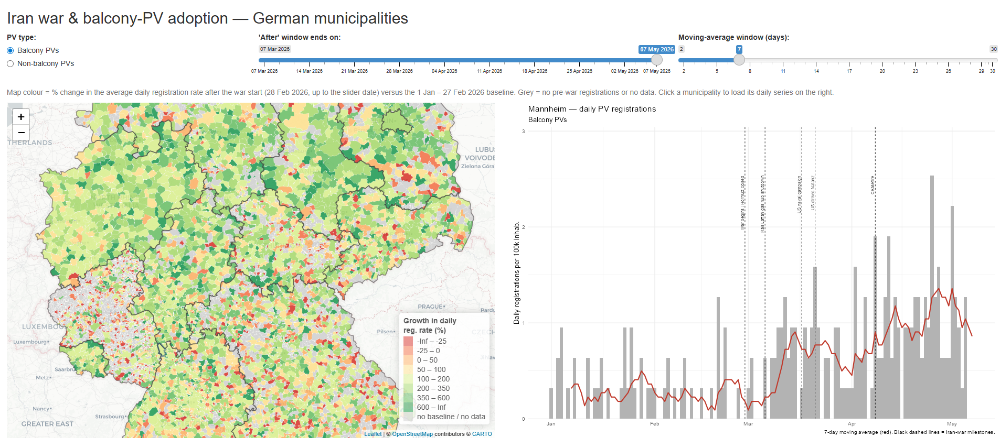

# 1. shiny app explanation

This interactive app explores how solar-PV registrations across German
municipalities reacted to the **2026 Iran war** (which began on 28 Feb 2026,
when Iran closed the Strait of Hormuz).

## What you see

**Left — the map.** Every German municipality, coloured by the **change in its
daily registration rate** after the war started versus the pre-war baseline
(1 Jan – 27 Feb 2026). Green = faster adoption after the war, red = slower.
Federal-state borders are drawn on top. Grey = no pre-war registrations or no
data.

**Right — the chart.** **Click any municipality** on the map to see its daily
PV registrations: grey bars are the raw daily counts, the red line is a moving
average, and the black dashed lines mark key Iran-war events. It opens on
**Mannheim** by default.

## Controls

| Control | What it does |
|---|---|
| **PV type** | Switch between *balcony* PVs and *non-balcony* PVs. |
| **'After' window** | Choose how far past the war start the comparison reaches — right after the war, or weeks later. |
| **Moving-average window** | Set how smooth the chart's trend line is. |

## Notes

- Registrations are **population-adjusted** (per 100k inhabitants). If a
  municipality has no population figure, the app shows raw counts and says so.
- The growth rate cancels out population, so it is comparable across
  municipalities of any size.