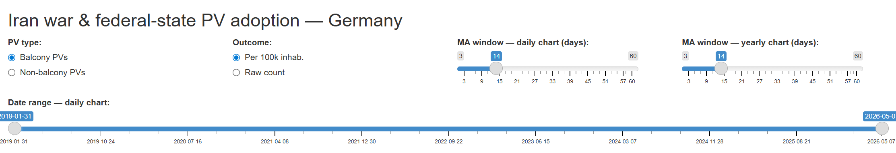
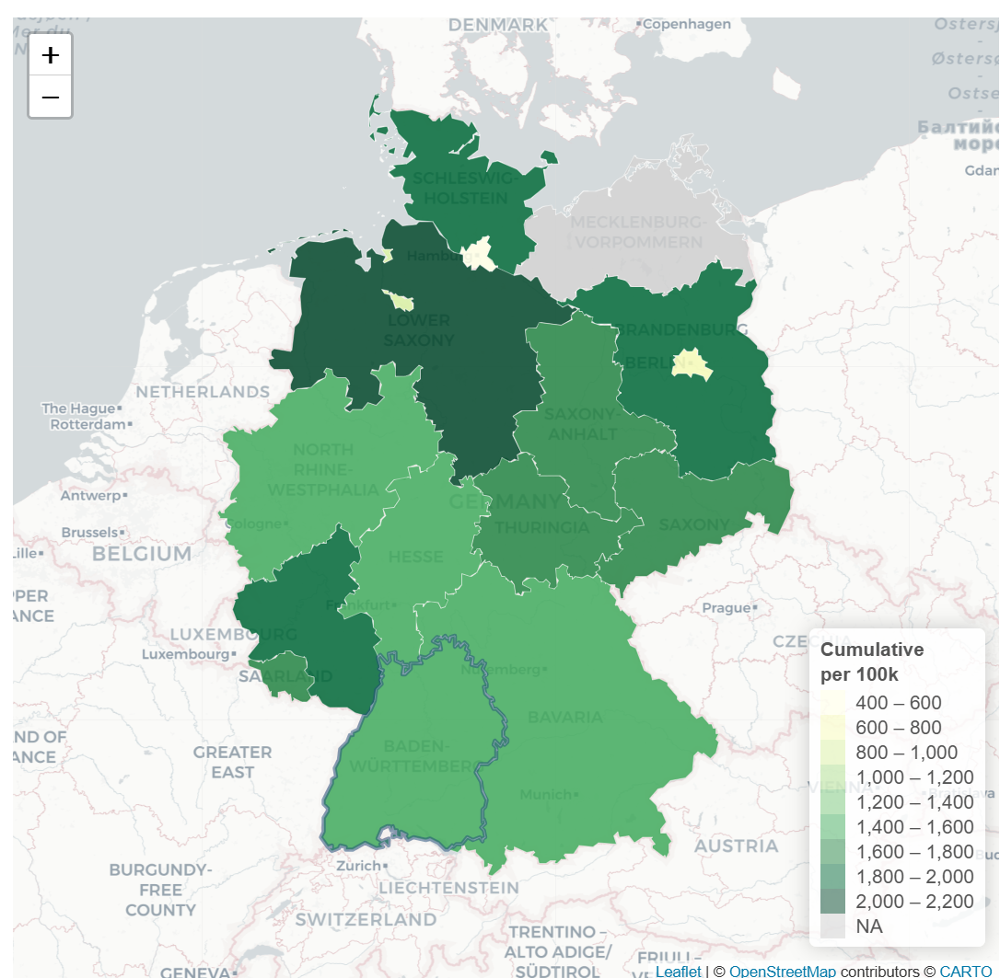
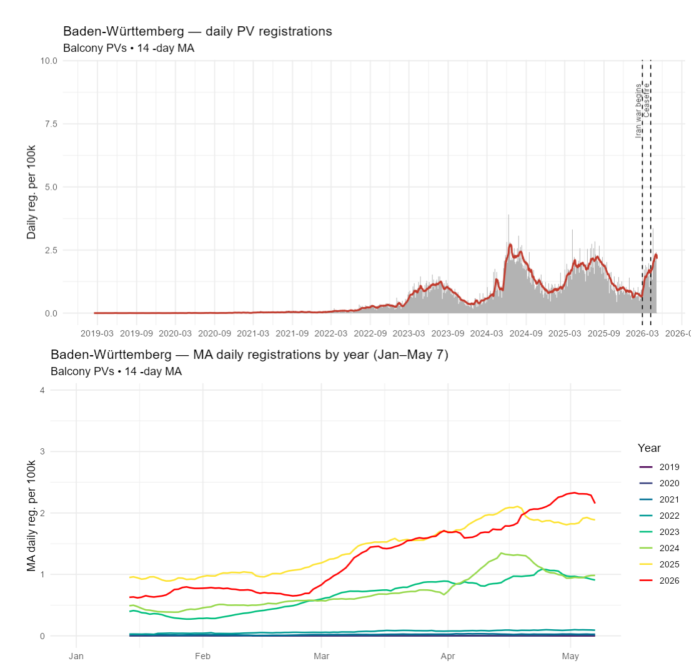

# Federal-state PV adoption — Shiny app

Interactive R Shiny app for exploring how the **2026 Iran war** affected solar-PV adoption across Germany's **16 federal states**. The app uses the German MaStR (Marktstammdatenregister) solar-unit registry, with plug-in PV systems split into **balcony** and **non-balcony** categories.

## What the app looks like

### 1. Controls (top of the page)



The control bar lets you choose:

- **PV type** — Balcony or Non-balcony.
- **Outcome** — raw count or per 100 000 inhabitants.
- **MA window — daily chart / yearly chart** — independent moving-average windows (in days) for the two charts.
- **Date range — daily chart** — restrict the daily chart's x-axis to a chosen period.

### 2. Map (left side)



A choropleth map of the 16 federal states, coloured by **cumulative PV registrations** over the whole sample. Click any state to update the right-side charts. The map opens with **Baden-Württemberg** selected by default.

### 3. Charts (right side)



Two stacked charts for the selected state:

- **Top — daily registrations**: grey bars are daily counts, the red line is the moving average. Two black dashed vertical lines mark the **Iran-war start (28 Feb 2026)** and the **ceasefire (8 Apr 2026)**.
- **Bottom — moving average by year**: one line per year over Jan – May 7 (so 2026's partial year compares like-for-like with the others). **2026 is drawn in red**; the other years use a viridis palette.

The y-axis scale is held **fixed across federal states** within the current PV-type / outcome choice, so clicking another state gives a directly comparable view.

## How to run it

1. Open `2. shiny app.qmd` in RStudio.
2. Make sure these two files are present **in the same folder**:
   - `federalState.parquet` — federal-state polygon boundaries.
   - `state_day.parquet` — daily registrations per state (produced by `1. dataset.qmd`).
3. Run the chunks (or click **Run Document**). The app opens in the viewer pane.

If `state_day.parquet` is missing, run `1. dataset.qmd` first to build it.

## Where the data comes from

- **PV registrations** — MaStR (Marktstammdatenregister), the official German solar-unit registry.
- **Federal-state population** — Destatis GENESIS table `12411-0010` (reference date 31 Dec 2023), pulled via the [`restatis`](https://cran.r-project.org/package=restatis) package.
- **Federal-state boundaries** — NUTS-1 regions for Germany.

The full data-building pipeline is documented in `1. dataset.qmd`.

## Folder contents

```
Federal States/
├── 1. dataset.qmd          # builds state_day.parquet from MaStR
├── 2. shiny app.qmd        # the Shiny app (UI + server in one chunk)
├── federalState.parquet    # federal-state polygons
├── state_day.parquet       # daily registrations per state (output of 1. dataset.qmd)
├── README.md               # this file
└── images/                 # screenshots used in this README
```
